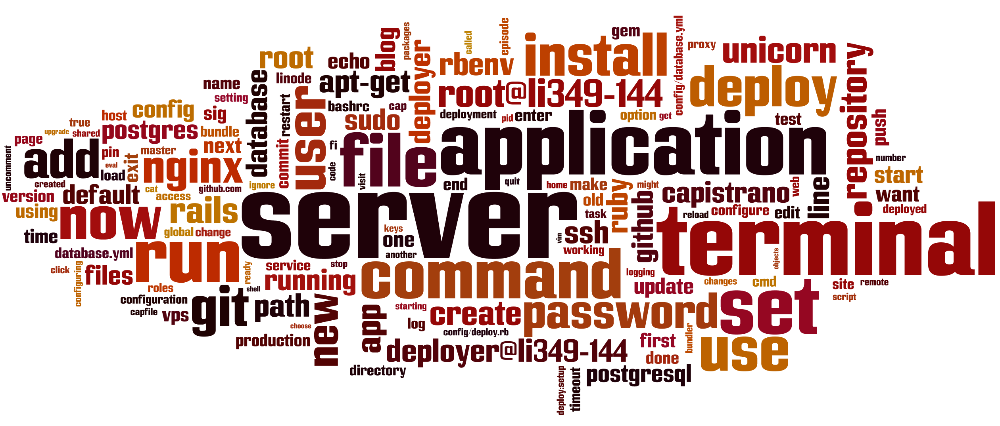

footer: Austin Ziegler ([@halostatue](https://github.com/halostatue)) 2015, CC-BY-SA
slidenumbers: true

# [fit] Rails :heart: Ansible

---
# [fit] Rails :heart: Ansible

### (with a little help)

---
# Rails Deploys

Simple, _right_?

1.  Put the application on the server.
2.  Bundle the gems.
3.  Apply migrations.
4.  Restart service.

---
# Easy Rails Deploys

    git push master heroku:master

[Heroku](https://heroku.com/), [Engine Yard](https://engineyard.com/), [Nine Fold](https://ninefold.com/), [OpenShift](https://openshift.com/), others…

Quick and easy, but inflexible and expensive.

---
# Your Own Infrastructure

More complex[^1], but more flexible and less expensive.



Also needs complex tools for the deploys: [Capistrano](http://capistranorb.com/), [Mina](http://mina-deploy.github.io/mina/), [Vlad](https://github.com/seattlerb/vlad).

[^1]: [Wordle](http://www.wordle.net) created from [RailsCast: Deploying to a VPS](http://railscasts.com/episodes/335-deploying-to-a-vps?view=asciicast).

---
# [fit] Production Server Rules:

1. *No* manual configuration.
2. *No* build tools.
3. *Limited* outbound network.
4. *Minimal* source code.

---
# [fit] *No* Manual Configuration
## Applications *are* Configuration

---
# [fit] *No* Build Tools
## *That* Build Hasn’t Been Tested

---
# [fit] *Limited* Outbound Network
## Do You Trust Your App?

---
# [fit] *Limited* Outbound Network
## Do You Trust Your App?
### (hack)
## Now Do You Trust Your App?

---
# [fit] *Minimal* Source Code
## *No* repos.

---
# [fit] Production Server Rules:

1. *No* manual configuration.
2. *No* build tools.
3. *Limited* outbound network connections.
4. *Minimal* source code, *no* source repos.

Oh, yeah:

---
# [fit] *All*
# [fit] Servers
# [fit] are
# [fit] Production

---
# But…

---
# [fit] No

---
# [fit] Modern Server Configuration

* [Chef](https://www.chef.io/chef/)
* [Puppet](https://puppetlabs.com/)
* [SaltStack](http://saltstack.com/)
* [Docker](https://docker.com)
* [Ansible](http://docs.ansible.com/)

---
# All Good, But…

Seriously. They are all good. Pick one and use it.


---
# [fit] Why?

---
# Three Reasons for Ansible

1. Simple.
2. Simple.
3. Simple.

---
# Three Reasons for Ansible

1. Simple to learn.
2. Simple.
3. Simple.

---
# Three Reasons for Ansible

1. Simple to learn.
2. Simple to use.
3. Simple.

---
# Three Reasons for Ansible

1. Simple to learn.
2. Simple to use.
3. Simple to secure.

---
# Simple To Learn

It’s just YAML. (This is a simplified playbook.)

```
- hosts: auth_server
  remote_user: root
  roles:
    - common
    - auth_server
    - role: stage_rails_application
      package_name: datahub-user-service
    - role: deploy_rails_application
      package_name: datahub-user-service
      as_user: www-data
```

---
# Simple To Learn

It’s just YAML. (This is a simplified role, a dependency for `auth_server`.)

```
- name: Install apt dependencies
  apt:
    name: "{{ item }}"
    state: present
  with_items:
    - debian-archive-keyring
    - nodejs
    - libpq
```

---
# Simple To Use

Run that simplified playbook.

```
ansible-playbook \
  -i dit_hosts \
  auth_server_package_deploy.yml
```

---
# Simple To Secure

```
ansible-vault \
  --vault-password-file=.vault_password.txt \
  edit group_vars/all/google_auth_config.yml

ansible-playbook \
  -i dit_hosts \
  --vault-password-file=.vault_password.txt \
  auth_server_package_deploy.yml
```

---
# [fit] Ansible Demo

> (Sorry, this part is not Rails, it’s my server.)

---
# [fit] How to make
# [fit] Rails :heart: Ansible

---
# Two Recommended Ways

1. Capistrano-in-Ansible
2. Package-Based Deploys

---
# Capistrano-in-Rails

## [Rebuilding Capistrano with Ansible](http://tech.taskrabbit.com/blog/2015/03/12/rebuilding-capistrano-with-ansible/)

-- Evan Tahler, TaskRabbit, March 12th 2015

I haven’t tried this, but it looks fantastic if you want a source-based Capistrano-style deploy.

---
# Package-Based Deploys

## OS-based Packages

OS-based packages with [pkgr](https://github.com/crohr/pkgr) (commercially support from [Packager.io](https://packager.io/)). Makes `deb` or `rpm` packages reusing Heroku buildpacks.

---
# Package-Based Deploys

## OS-based Packages

These are good, but rollbacks—especially involving database changes—are *hard*.

---
# Package-Based Deploys

## Slug Builders

[Cartage](https://github.com/KineticCafe/cartage/), our solution, is a slug builder.

---
# Cartage

Four parts:

* [cartage](https://github.com/KineticCafe/cartage/): build deployment packages.
* [cartage-s3](https://github.com/KineticCafe/cartage-s3): uploads deployment packages to S3 using [Fog](http://github.com/fog/fog).
* [cartage-remote](https://github.com/KineticCafe/cartage-remote): connects to a remote server to run cartage, using Fog.
* [cartage-rack](https://github.com/KineticCafe/cartage-rack): a Rack app showing the current release.

---
# Cartage: cartage

* Opinionated tool that:

    * Creates a deployable package from a manifest,
    * with gem dependencies bundled,
    * and the git hashref of the build recorded,
    * as a timestamped tarball.

---
# Cartage: cartage-s3

* Uploads a cartage package to an S3 bucket, using [Fog](http://github.com/fog/fog).

---
# Cartage: cartage-remote

* Connects to a remote server, using [Fog](http://github.com/fog/fog).

---
# Cartage: cartage-rack

* A Rack application that returns the current release hashref.

```
% rails start
% curl localhost:3000/release
development: (git) main
```

---
# Future Cartage

* Add more languages/environments. Node.js, Python, etc.
* More workflow support.
* Maybe look at buildpack support.

---
# [fit] Questions?
